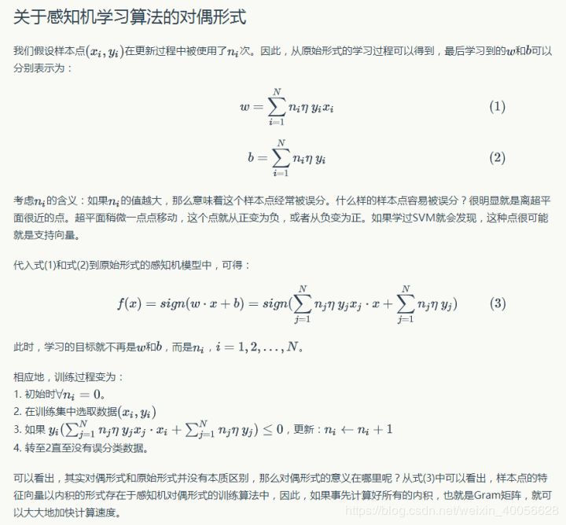

##主要内容
* 感知机模型
* 感知机学习策略
* 感知机学习算法

#### 1.感知机模型
感知机是一种线性分类模型，属于判别模型。
假设空间是 定义在特征空间的所有线性分类模型。
所谓的感知机就是在n为空间内的超平面(n-1)维,这个超平面将空间分成两部分。
超平面又称为分离超平面。
超平面s定义为 w*x+b=0，其中w*x+b>0的空间定义为正，w*x+b<0的空间定义为负,即： $f(x) = sign(w*x+b)$

#### 2.感知机学习策略
数据集的线性可分性： 对于一个线性可分的训练集，我们能够找到（至少）一个分离超平面，该超平面能把训练集的正、负实例点完全地分离开，则数据集是线性可分。

感知机学习策略：为了找到分离超平面，确定感知机模型参数w，b 确定一个学习策略(即 定义损失函数，并将其最小化)

损失函数的选择：误分类点到超平面s的总距离。输入空间一点x0到超平面的距离定义为 $\frac{1}{||w||}|w*x_0+b|$ $||w||$是w的L2范式。因为误分类中yi和$w*x_0+b$是异号，所以有 $-y_i(w*x_i+b)>0$ 所以误分类点到超平面的距离又为 $-\frac{1}{||w||}y_i(w*x_0+b)$ 
 
若超平面S的误分类点集合为M，则所有误分类点到超平面的总距离为:$-\frac{1}{||w||}\sum_{x_i\in M}y_i(w*x_i+b)$ 
如果如考虑1/||w||（对损失函数乘上一个非0常数并不会影响极值点的取值），那么就得到感知机的损失函数：
$$L(w,b)=-\sum_{x_i\in M}y_i(w*x_i+b)$$

#### 3.感知机学习算法
上述得到了感知机问题的损失函数，接下来是通过随机梯度下降进行损失函数的最优化。

a、感知机学习算法的原始形式
该算法使用的是梯度下降，但在极小化的过程中并非一次使得M中的误分类点的梯度下降，而是一次随机选取一个误分类点进行梯度下降。

算法的收敛性证明：
太难表达了，直接记录一个大佬博客吧，简单易懂：https://blog.csdn.net/weixin_41911765/article/details/81811231

b、感知机学习算法的对偶形式

